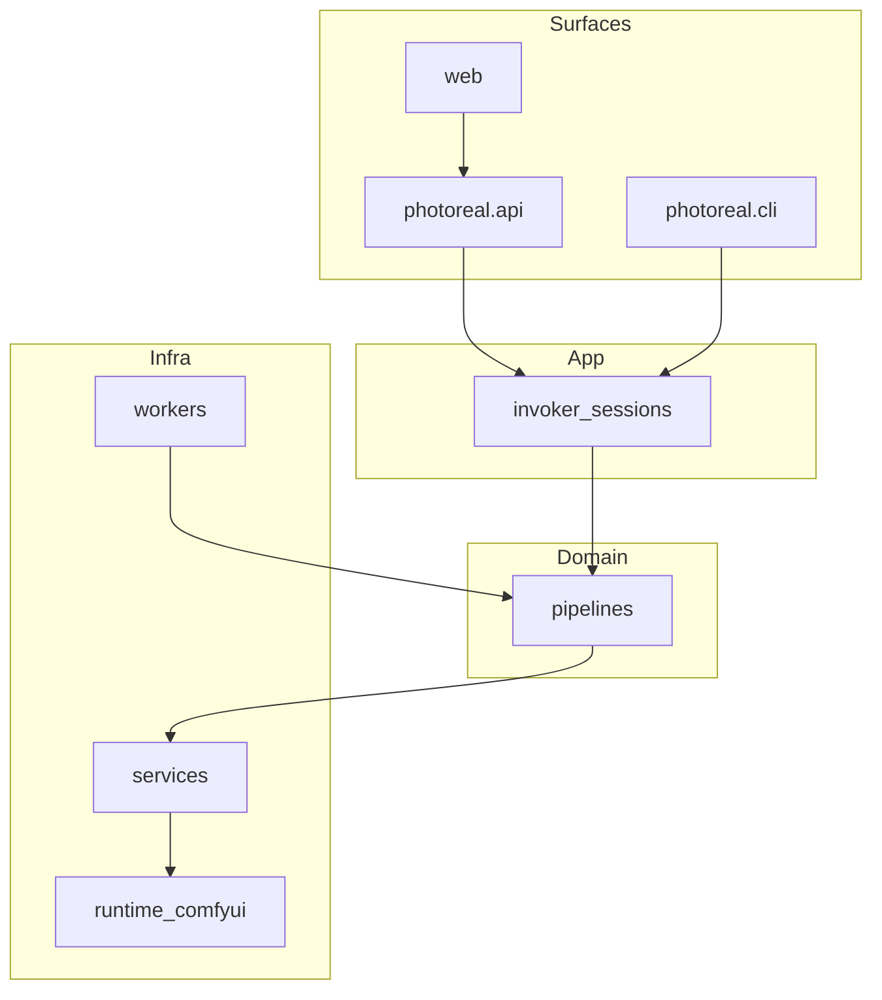

# Architecture

Hybrid local studio: surfaces call the app invoker; pipelines own generation abilities; services abstract shared infra; workers are optional deploy entrypoints; runtime hosts engines (e.g. ComfyUI).

## Layer rules

1. **`pipelines/`** — user-facing generation abilities (the catalog). One module per task; subclass `Pipeline`.
2. **`services/`** — shared infrastructure (storage, models, queue, images). No prompts or workflows here.
3. **`workers/`** — deploy/process entrypoints that call a pipeline. Empty until a capability needs remote/GPU packaging.
4. **`app/`** — session/job orchestration only.
5. **`runtime/`** — ComfyUI or other engines; never import product UI from here.
6. **`data/`** — weights and artifacts; not source code.

## Naming

- Pipeline module = verb/task: `image_edit.py`, not `qwen_edit_service`.
- Backend/model names live inside the pipeline implementation, not in folder names.
- New ability = one file under `pipelines/<domain>/` (+ optional `workers/<name>.py`).

## Abilities

- **`photoreal_gen`** — Klein 9B Base + LoRAs via unmodified `runtime/comfyui`. See [photoreal_gen.md](photoreal_gen.md).
- **`vlm` / `reprompt`** — Qwen3-VL. See [vlm.md](vlm.md).
- **`sam3_segment`** — SAM 3.1 image masks via Comfy `SAM3_Detect`. See [sam3_segment.md](sam3_segment.md).
- **`depth_subject`** — Depth Anything 3 + SAM mask composite (person-only depth). See [depth_subject.md](depth_subject.md).
- **`character_depth`** — Depth map + character reference via RefControl depth LoRA (CLI only for now). See [character_depth.md](character_depth.md).
- **`character_inpaint`** — Scene plate + mask + character reference → lighting bake (CLI only for now). See [character_inpaint.md](character_inpaint.md).
- **`wan_animate`** — Wan2.2 Animate Animation (Move) mode: pose-locked still + driving video; timeline Wan Animate / Extend Animate (`role=animate`). See [wan_animate.md](wan_animate.md).
- **Replace Character (timeline)** — Segment → Depth → Character Reference → Pose Lock → Wan Animate. See [replace_character.md](replace_character.md).
